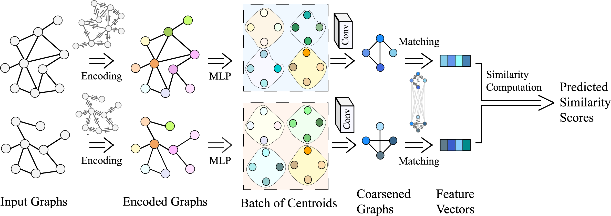

# Hierarchical Large-scale Graph Similarity Computation via Graph Coarsening and Matching


## Requirements

To install requirements:

```setup
Using pip:
	pip install -r requirements_pip.txt

Using conda:
	conda create -n your_env_name --file requirements_conda.txt
```

## Training

To train the model in the paper, run this command:

```train
python main.py --dataset <dataset> --num_iters <number_of_training_iterations> --model <model_name> --dos_true 'dist'
```

\<dataset> can be among \{BA_60, BA_100, BA_200, ER_100, IMDB-L}.

\<model_name> can be among \{GCN-Mean, GCN-Max, simgnn, gsim_cnn, GMN, CoSim-CNN, CoSim-Mem, CoSim-ATT, CoSim-SAG, CoSim-TOPK, CoSim-GNN10, CoSim-GNN1}

## Evaluation

To evaluate the models, run:

```eval
python main.py --dataset <dataset> --num_iters <number_of_training_iterations> --model <model_name> --dos_true 'dist' --load_model <model.pth>
```

## Pre-trained Models

Download pretrained models here:

- [Pre-trained_models](https://drive.google.com/drive/folders/1YHqV2F22ZbbGQshf9JHHvBAjLqZi3Tyx?usp=sharing)

## Results

The results are shown as below:

<table>
   <tr>
      <td>model</td>
      <td>BA-60</td>
      <td></td>
      <td>BA-100</td>
      <td></td>
      <td>BA-200</td>
      <td></td>
      <td>ER-100</td>
      <td></td>
      <td>IMDB-L</td>
      <td></td>
   </tr>
   <tr>
      <td></td>
      <td>MSE</td>
      <td>MAE</td>
      <td>MSE</td>
      <td>MAE</td>
      <td>MSE</td>
      <td>MAE</td>
      <td>MSE</td>
      <td>MAE</td>
      <td>MSE</td>
      <td>MAE</td>
   </tr>
   <tr>
      <td>HUNGARIAN</td>
      <td>186.19</td>
      <td>332.2</td>
      <td>205.83</td>
      <td>343.83</td>
      <td>259.06</td>
      <td>379.38</td>
      <td>236.15</td>
      <td>451.66</td>
      <td>2.67</td>
      <td>16.6</td>
   </tr>
   <tr>
      <td>VJ</td>
      <td>258.73</td>
      <td>294.83</td>
      <td>273.94</td>
      <td>404.61</td>
      <td>314.45</td>
      <td>426.86</td>
      <td>275.22</td>
      <td>463.53</td>
      <td>7.68</td>
      <td>22.73</td>
   </tr>
   <tr>
      <td>BEAM</td>
      <td>59.14</td>
      <td>129.26</td>
      <td>114.02</td>
      <td>203.76</td>
      <td>186.03</td>
      <td>287.88</td>
      <td>104.73</td>
      <td>226.42</td>
      <td>0.39</td>
      <td>3.93</td>
   </tr>
   <tr>
      <td>GCN-MEAN</td>
      <td>5.85</td>
      <td>53.92</td>
      <td>12.53</td>
      <td>90.88</td>
      <td>23.66</td>
      <td>127.58</td>
      <td>16.58</td>
      <td>92.98</td>
      <td>22.17</td>
      <td>55.35</td>
   </tr>
   <tr>
      <td>GCN-MAX</td>
      <td>13.66</td>
      <td>91.38</td>
      <td>12.04</td>
      <td>85.44</td>
      <td>22.77</td>
      <td>107.58</td>
      <td>79.09</td>
      <td>211.07</td>
      <td>47.14</td>
      <td>123.16</td>
   </tr>
   <tr>
      <td>SIMGNN</td>
      <td>8.57</td>
      <td>63.8</td>
      <td>6.23</td>
      <td>47.8</td>
      <td>3.06</td>
      <td>32.77</td>
      <td>6.37</td>
      <td>45.3</td>
      <td>7.42</td>
      <td>33.74</td>
   </tr>
   <tr>
      <td>GSIMCNN</td>
      <td>5.97</td>
      <td>56.05</td>
      <td>1.86</td>
      <td>30.18</td>
      <td>2.35</td>
      <td>32.64</td>
      <td>2.93</td>
      <td>34.41</td>
      <td>5.01</td>
      <td>30.43</td>
   </tr>
   <tr>
      <td>GMN</td>
      <td>2.82</td>
      <td>38.38</td>
      <td>4.14</td>
      <td>34.17</td>
      <td>1.16</td>
      <td>26.6</td>
      <td>1.59</td>
      <td>28.68</td>
      <td>3.82</td>
      <td>27.28</td>
   </tr>
   <tr>
      <td>COSIM-CNN</td>
      <td>2.5</td>
      <td>35.53</td>
      <td>1.49</td>
      <td>27.2</td>
      <td>0.53</td>
      <td>18.44</td>
      <td>2.78</td>
      <td>33.36</td>
      <td>10.37</td>
      <td>38.03</td>
   </tr>
   <tr>
      <td>COSIM-ATT</td>
      <td>2.04</td>
      <td>33.41</td>
      <td>0.97</td>
      <td>22.95</td>
      <td>0.73</td>
      <td>16.26</td>
      <td>1.39</td>
      <td>27.27</td>
      <td>1.53</td>
      <td>16.57</td>
   </tr>
   <tr>
      <td>COSIM-SAG</td>
      <td>3.26</td>
      <td>38.85</td>
      <td>3.3</td>
      <td>33.14</td>
      <td>1.91</td>
      <td>35.48</td>
      <td>1.55</td>
      <td>29.84</td>
      <td>1.62</td>
      <td>16.08</td>
   </tr>
   <tr>
      <td>COSIM-TOPK</td>
      <td>3.44</td>
      <td>40.87</td>
      <td>1.24</td>
      <td>25.61</td>
      <td>0.88</td>
      <td>20.63</td>
      <td>2.04</td>
      <td>34.28</td>
      <td>1.98</td>
      <td>20.02</td>
   </tr>
   <tr>
      <td>COSIM-MEM</td>
      <td>5.45</td>
      <td>48.07</td>
      <td>1.11</td>
      <td>24.59</td>
      <td>0.32</td>
      <td>14.82</td>
      <td>1.74</td>
      <td>26.78</td>
      <td>1.57</td>
      <td>17.02</td>
   </tr>
   <tr>
      <td>COSIM-GNN10</td>
      <td>1.56</td>
      <td>29.33</td>
      <td>0.9</td>
      <td>21.75</td>
      <td>0.47</td>
      <td>16.35</td>
      <td>1.18</td>
      <td>26.91</td>
      <td>1.45</td>
      <td>15.68</td>
   </tr>
   <tr>
      <td>COSIM-GNN1</td>
      <td>1.67</td>
      <td>30.88</td>
      <td>0.9</td>
      <td>21.89</td>
      <td>0.63</td>
      <td>18.35</td>
      <td>1.3</td>
      <td>27.87</td>
      <td>1.48</td>
      <td>15.32</td>
   </tr>
</table>


To reproduce the results, just download the trained models and set <model.pth> below to any trained models trained under specific dataset. The code will automatically extract all the trained models and validate them on the validation set to choose the best one on the validation set for testing.

```eval
python main.py --dataset <dataset> --num_iters <number_of_training_iterations> --model <model_name> --dos_true 'dist' --load_model <model.pth>
```


## Contributing

> 📋Pick a licence and describe how to contribute to your code repository. 